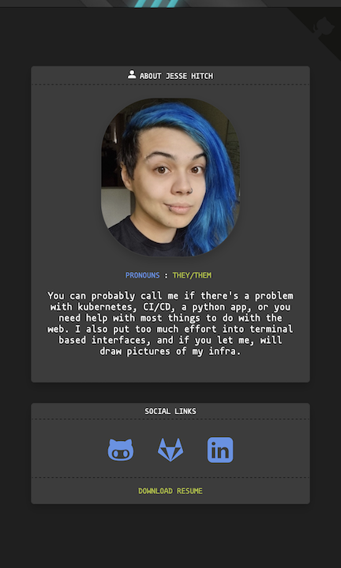

# Tiny Personal Website [](./LICENSE)

This is a small Python based personal website aimed first and foremost at being a resume.
I originally wrote this a decade or so ago, and recently absolutely borked my
react website, resulting in me quickly resurrecting this thing in about a day
and a half. It was actually pretty fun though, so I've continued to add little features.
This one does the same thing, but better, and faster, with less js.
Feel free to fork this and make it your own, but keep it open source.

[](https://www.docker.com/)
[](https://www.python.org/)
[](https://flask.palletsprojects.com/en/2.2.x/)
[](https://getbootstrap.com/)



## Getting Started

Clone this github repo into your desired webroot, and install dependencies with [poetry](https://python-poetry.org/docs/#installation):

`poetry install`

You can configure everything (e.g. website title, your photo, quote, etc)
by editing `tiny_personal_website/config/config.yaml` and replacing all the Jesse data with your own.

For testing locally with docker, you can do:

```bash
docker build . -t <name of tag you want>

# to test locally, you can do -p 8000:8080 to forward
# port 8080 on the container to port 8000 on your local machine
docker run --rm -p 8000:8080 <name of the tag you used>
```

Then you can go to http://127.0.0.1:8000 in a browser to view your changes.

### Deploying on an app platform

You want the following command plugged into where-ever this runs
(e.g. digital ocean app platform):

```bash
gunicorn --worker-tmp-dir /dev/shm app:app
```

And the container port of note is port 8080.
